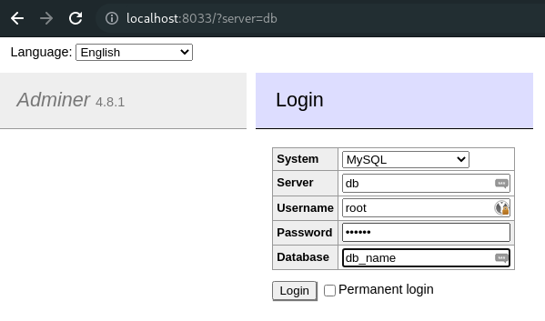
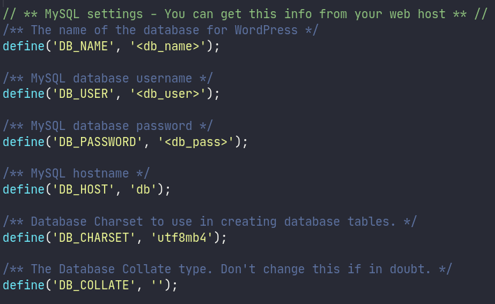
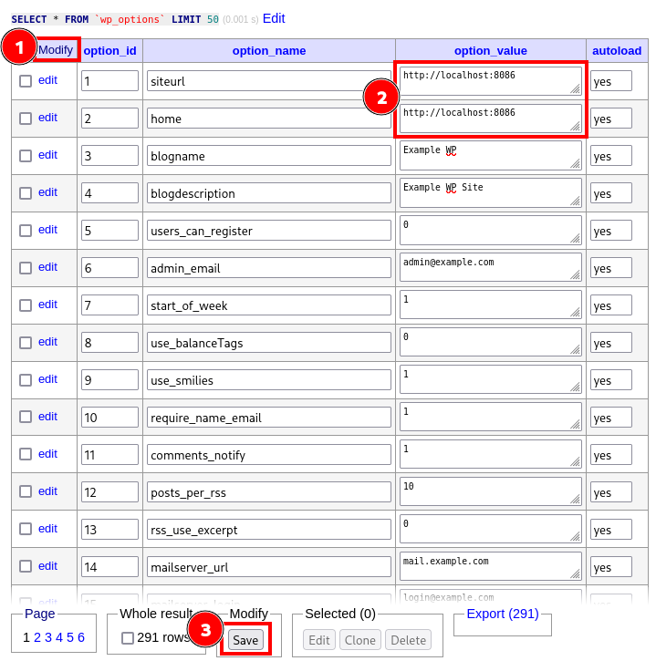
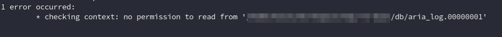

# Docker Test Environment for Wordpress (PHP/LAMP)

A test-environment for Wordpress or other PHP/LAMP based websites/services.

You need [Docker](https://www.docker.com/) and [Docker-Compose](https://docs.docker.com/compose/) to get it up and running.

## Configuration
Adapt the [docker-compose.yml](./docker-compose.yml) to your needs.

Currently, it includes 3 different services.

1. webserver
  ```yml
  webserver:
    container_name: test-ws  # name of the container. adapt to your needs
    build:
      context: ./php
      dockerfile: Dockerfile
    depends_on:
      - db
    volumes:
      - ./www:/var/www/html/ # bind the local folder 'www' to the container '/var/www/html/' (www-root)
      - ./php/php.ini:/usr/local/etc/php/conf.d/php.ini # bind custom php.ini for custom configurations
    ports:
      - 8086:80 # bind container-port 80 to local port, adapt to your needs
  ```
  - see [php-config](#php-config)
2. db
  ```yml
  db:
    container_name: test-db # name of the container. adapt to your needs
  image: mariadb # database image. adapt to your needs
  environment: # database/environment settings. adapt to your needs
    - MYSQL_ROOT_PASSWORT=<db_root_pass>
    - MYSQL_PASSWORD=<db_user_pass>
    - MYSQL_USER=<db_user>
    - MYSQL_DATABASE=<db_name>
  volumes:
    - ./db:/var/lib/mysql # bind local folder 'db' to container '/var/lib/mysql'
  ports:
    - 3306:3306 # bind container-port to local port, adapt to your needs
  ```
  - checkout [Docker:mariadb](https://hub.docker.com/_/mariadb), [Docker:mysql](https://hub.docker.com/_/mysql) for additional information about config
  - see [db-config](#db-config)
3. adminer (*minimal db-browser, like phpmyadmin*)
  ```yml
  adminer:
    container_name: test-adminer # name of the container, adopt to your needs
    depends_on:
      - db
    image: adminer
    ports:
      - 8033:8080 # bin container-port 8080 to local port to access adminer via `http://localhost:<PORT>
  ```
  - checkout [Docker:adminer](https://hub.docker.com/_/adminer)
  - see [adminer](#adminer)

### PHP Config
Set your custom php-configurtions with [php/php.ini](php.php.ini), which will be bindet to the container.  
When you do some changes to the file while the container is running:
- restart container: `docker-compose restart webserver` OR
- restart apache inside container:
  - `docker-compose exec webserver apachectl restart` OR
  - `docker container exec <CONTAINER-NAME> apachectl restart`

The [Docker:php](https://hub.docker.com/_/php) comes with some php extensions and apache-modules already activated. When you need additional, adapt the [php/Dockerfile](php/Dockerfile). See "how to install more PHP extension" on [Docker:php](https://hub.docker.com/_/php) or use the examples in [php/Dockerfile](php/Dockerfile) as startpoint.  

The same is for apache-modules (like `mod_rewrite`). When you do changes in [php/Dockerfile](php/Dockerfile) you have to re-build the image.
- `docker-compose build webserver`

When the container is already running, `restart` it after `build`.

### DB Config
Checkout the reference on [docker-hub](https://hub.docker.com/search?type=image) for your desired db-system. For MariaDB/MySQL, see also the existing implementation in [docker-compose](docker-compose.yml).

To connect to the database from php-container, use `db` as hostname *(name of the service)*.

### Adminer
[Database management tool](https://www.adminer.org/), like phpmyadmin.

For **server**, use `db` *(name of the service)*.



### Wordpress
To create a Wordpress test environment, copy the whole content of your wordpress-installation into the [www](./www) folder and adapt the `wp-config.php` file, by editing the database settings.



**Import** the database-dump and adapt the `wp_options` table (`siteurl` and `home`).



Simple, copy/adapt all needed files in [php](./php) to your needs.


### Known problems
When you do some changes (e.g. adopt [Dockerfile](php/Dockerfile)) and run something like `docker-compose build ...` etc. you may get an error, because of permission error



Simple update the permissions of the [db](./db) folder, e.g.:

```console
$ sudo chgrp -R docker db/
$ sudo chmod g+rwx -R db/
```

